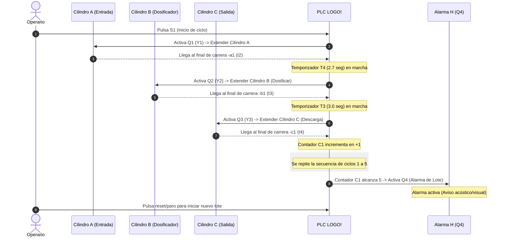

# Documentación de la Máquina Dosificadora (3 Cilindros)

Este documento detalla el diseño, los componentes y el comportamiento del primer modelo de dosificadora automatizada ([cadesimu-dosificadora.cad](file:///d:/Work/Simu/cadesimu-dosificadora.cad)), el cual consta de 3 cilindros neumáticos y control mediante un PLC Siemens LOGO!.

---

## 1. Listado de Elementos del Sistema

El circuito se compone de elementos de entrada (sensores y pulsadores), un controlador lógico programable y elementos de salida (actuadores neumáticos e indicadores).

### A. Elementos de Entrada (Captadores / Sensores)
| Etiqueta | Tipo de Dispositivo | Canal PLC | Descripción |
| :--- | :--- | :--- | :--- |
| **S1** | Pulsador de Marcha (NA) | `I1` | Inicia el ciclo de dosificación. |
| **B** | Pulsador de Emergencia/Paro (NC) | `I5` | Detiene inmediatamente la secuencia por seguridad. |
| **-a1** | Final de carrera neumático (NA) | `I2` | Detecta la extensión completa del Cilindro A (Cámara de entrada abierta). |
| **-b1** | Final de carrera neumático (NA) | `I3` | Detecta la extensión completa del Cilindro B (Dosificación/Pistón extendido). |
| **-c1** | Final de carrera neumático (NA) | `I4` | Detecta la extensión completa del Cilindro C (Válvula de descarga abierta). |

### B. Elementos de Salida (Actuadores y Alertas)
| Etiqueta | Tipo de Dispositivo | Canal PLC | Descripción |
| :--- | :--- | :--- | :--- |
| **Y1** | Electroválvula (Bobina) | `Q1` | Controla el movimiento del Cilindro A (Alimentación / Compuerta superior). |
| **Y2** | Electroválvula (Bobina) | `Q2` | Controla el movimiento del Cilindro B (Émbolo empujador / Cámara de dosificación). |
| **Y3** | Electroválvula (Bobina) | `Q3` | Controla el movimiento del Cilindro C (Compuerta inferior / Descarga). |
| **H** | Indicador Luminoso/Acústico | `Q4` | Alarma/Aviso que se activa al completar un lote de 5 ciclos de dosificación. |

---

## 2. Diagrama de Casos de Uso (Diagrama de Uso)

Representa las interacciones entre los actores (el Operario y los componentes de hardware) y las funciones principales del sistema de dosificación.

```mermaid
  leftToRightDirection
  actor Operario as "Operario"
  actor PLC as "PLC LOGO!"
  actor Actuadores as "Cilindros Neumáticos"
  
  rectangle "Sistema Dosificador (3 Cilindros)" {
    usecase UC1 as "Iniciar Lote de Dosificación"
    usecase UC2 as "Paro de Emergencia"
    usecase UC3 as "Controlar Compuertas de Entrada/Salida"
    usecase UC4 as "Accionar Pistón Volumétrico"
    usecase UC5 as "Contar Ciclos (Lotes)"
    usecase UC6 as "Activar Alarma de Lote Completo"
  }
  
  Operario --> UC1
  Operario --> UC2
  
  UC1 ..> UC3 : <<include>>
  UC1 ..> UC4 : <<include>>
  
  UC3 --> Actuadores
  UC4 --> Actuadores
  
  PLC --> UC3
  PLC --> UC4
  PLC --> UC5
  PLC --> UC6
  
  UC5 ..> UC6 : <<trigger>>
```

---

## 3. Diagrama de Secuencia de Operación

Describe el paso a paso temporal de la dosificación. Muestra cómo fluyen las señales desde que el Operario pulsa el botón de inicio hasta que se dispara la alarma al completar 5 ciclos de llenado.



---

## 4. Descripción Detallada del Ciclo de Trabajo

1. **Estado de Reposo:** Todos los cilindros están retraídos (`-a0`, `-b0`, `-c0` activos). El contador `C1` está en 0.
2. **Inicio del Proceso:** Al presionar `S1` (`I1`), el PLC activa la salida `Q1` alimentando el solenoide `Y1`. El **Cilindro A** se extiende para permitir el ingreso de material a la cámara.
3. **Temporización de Llenado:** Al extenderse por completo y tocar `-a1` (`I2`), el PLC inicia un conteo regresivo de **2.7 segundos (T4)**. Este retardo asegura el llenado correcto de la recámara de medición.
4. **Dosificación Volumétrica:** Transcurrido el tiempo `T4`, el PLC activa `Q2` (`Y2`). El **Cilindro B** se extiende para empujar y comprimir el volumen dosificado.
5. **Temporización de Compresión:** Al tocar `-b1` (`I3`), comienza la segunda temporización de **3.0 segundos (T3)** para asegurar que todo el volumen ha sido desplazado correctamente.
6. **Descarga:** Al finalizar `T3`, se activa `Q3` (`Y3`), lo que hace que el **Cilindro C** se extienda (abriendo la compuerta de descarga inferior) y vacíe el producto en la botella o recipiente.
7. **Conteo de Ciclo:** Al completarse la extensión del Cilindro C (activando `-c1`), se envía un pulso al contador del LOGO!. Luego de descargar, los cilindros retornan a su posición inicial para iniciar la siguiente dosificación.
8. **Alarma de Lote Completado:** Cuando el contador interno alcanza el límite de **5 ciclos**, el PLC detiene temporalmente la secuencia automática y activa la salida `Q4` (`H`) para alertar al operario que retire la bandeja de lote completo.
