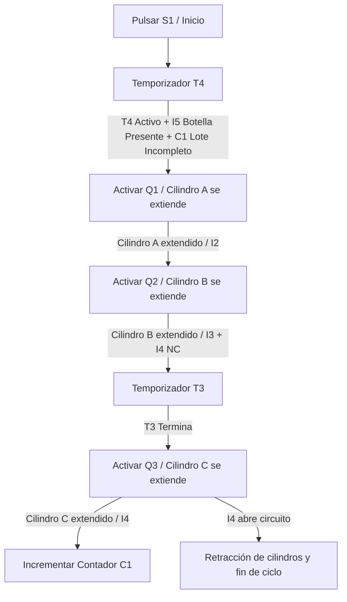
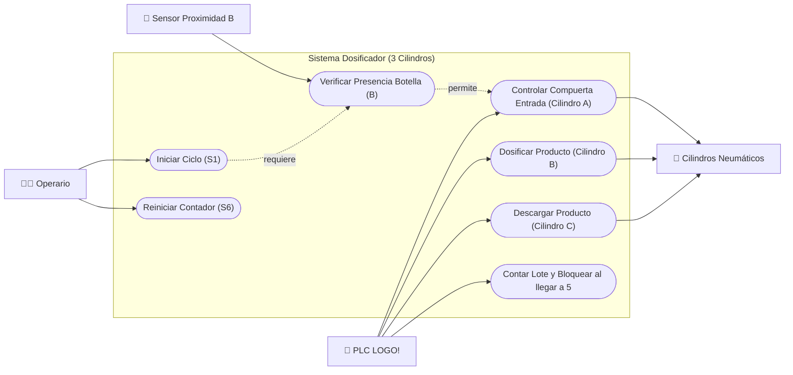

# Documentación de la Máquina Dosificadora (3 Cilindros)

Este documento detalla el diseño, los componentes y el comportamiento del primer modelo de dosificadora automatizada ([cadesimu-dosificadora.cad](file:///d:/Work/Simu/cadesimu-dosificadora.cad)), el cual consta de 3 cilindros neumáticos y control mediante un PLC Siemens LOGO!.

---

## 1. Arquitectura de Conexión Eléctrica (PLC LOGO!)

El sistema utiliza un PLC **Siemens LOGO! 24RCE** como cerebro de control. Las señales de campo se conectan de la siguiente manera:

### A. Alimentación y Entradas Digitales (X10)
* **P1 / P2:** Alimentación del PLC (Línea de corriente continua `+` y `-`).
* **I1 (Pulsador de Marcha S1):** Conectado al pulsador azul de marcha (`S1`). Da inicio a la secuencia.
* **I2 (Contacto S2 - Sensor -a1):** Entrada digital controlada por el relé auxiliar `S2`. Se activa cuando el Cilindro A llega a su extensión completa.
* **I3 (Contacto S3 - Sensor -b1):** Entrada digital controlada por el relé auxiliar `S3`. Se activa cuando el Cilindro B llega a su extensión completa.
* **I4 (Contacto S4 - Sensor -c1):** Entrada digital controlada por el relé auxiliar `S4`. Se activa cuando el Cilindro C llega a su extensión completa.
* **I5 (Contacto S5 - Sensor de Botella B):** Entrada digital controlada por el relé auxiliar `S5`. Este relé es accionado por el sensor de proximidad inductivo/capacitivo `B` para verificar la **presencia de una botella** en la zona de llenado.
* **I6 (Pulsador de Reset S6):** Conectado al pulsador verde de reset (`S6`). Permite reiniciar el contador de lotes `C1`.

### B. Salidas Digitales de Relé (X11)
* **Q1 (Solenoide Y1):** Envía señal para conmutar la electroválvula del **Cilindro A** (Alimentación).
* **Q2 (Solenoide Y2):** Envía señal para conmutar la electroválvula del **Cilindro B** (Pistón Dosificador).
* **Q3 (Solenoide Y3):** Envía señal para conmutar la electroválvula del **Cilindro C** (Descarga).
* **Q4 (Lámpara H):** Activa el piloto luminoso/alarma cuando el contador de lotes alcanza el límite preestablecido.

---

## 2. Acoplamiento de Sensores y Relés Intermedios
Para aislar y proteger las entradas del PLC, los finales de carrera neumáticos y los sensores de proximidad no se conectan directamente al LOGO!. En su lugar, activan bobinas de relés auxiliares:
* El sensor magnético de posición **-a1** activa la bobina del relé **S2**.
* El sensor magnético de posición **-b1** activa la bobina del relé **S3**.
* El sensor magnético de posición **-c1** activa la bobina del relé **S4**.
* El sensor de proximidad de botella **B** activa la bobina del relé **S5**.

---

## 3. Lógica de Control (Esquema Ladder)

La lógica programada dentro del PLC LOGO! sigue las siguientes reglas en el diagrama Ladder:

### Explicación de cada línea del programa Ladder:
1. **Línea 1 (Inicio de Proceso):** Al pulsar `I1` (Marcha `S1`), se energiza el temporizador **T4** (Temporizador de Llenado).
2. **Línea 2 (Control de Compuerta de Tolva A):** La salida `Q1` (Cilindro A) se activa si se cumplen tres condiciones simultáneamente:
   * El temporizador **T4** está activo (contacto `T4` cerrado).
   * Hay una botella detectada por el sensor `B` (contacto de entrada `I5` cerrado).
   * El contador de lotes **C1** no ha llegado a su límite de 5 ciclos (contacto normalmente cerrado `C1` cerrado).
3. **Línea 3 (Control de Pistón Dosificador B):** Al extenderse el Cilindro A y activarse `I2` (contacto del relé `-a1`), se activa inmediatamente la salida `Q2` para extender el **Cilindro B** (inyectar producto).
4. **Línea 4 (Retardo de Descarga):** Cuando el Cilindro B se extiende completamente y activa `I3` (relé `-b1`), se inicia el temporizador **T3** (3.0s), siempre y cuando el Cilindro C no esté extendido (contacto normalmente cerrado `I4` cerrado).
5. **Línea 5 (Control de Compuerta de Salida C):** Al transcurrir el tiempo de **T3**, se cierra el contacto y se activa `Q3` (Cilindro C) para abrir la compuerta de descarga inferior.
6. **Línea 6 (Reset del Lote):** Al pulsar `I6` (Pulsador verde `S6`), se envía un pulso a la entrada `R` (Reset) del contador **C1** para ponerlo a cero e iniciar un nuevo lote.
7. **Línea 7 (Conteo de Ciclos):** Al activarse la salida `Q3` (Cilindro C en descarga), se envía un pulso a la entrada de conteo del bloque contador **C1**. Al llegar a 5, el contacto `C1` de la línea 2 se abre, bloqueando nuevas dosificaciones hasta que se presione reset.

---

## 4. Circuito Neumático de Potencia

El sistema de fuerza neumática consta de 3 secciones idénticas:
* **Cilindros:** 3 Actuadores de doble efecto (**A**, **B**, **C**).
* **Control de velocidad:** Cada cilindro tiene dos **válvulas reguladoras de flujo unidireccionales reguladas al 50%**, lo que garantiza movimientos suaves y controlados para evitar derrames de producto.
* **Válvulas Distribuidoras:** Cada cilindro es gobernado por una **válvula 5/2 monoestable con retorno por muelle** activada por solenoide (`Y1`, `Y2`, `Y3`). Al desactivarse la salida del PLC, el muelle regresa automáticamente la válvula a su estado de reposo, retrayendo el cilindro de forma segura.

---

## 5. Diagrama de Casos de Uso (Visualización General)

