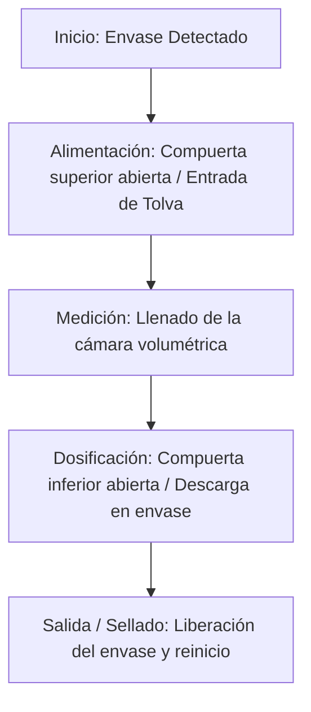

# Concepto General de una Máquina Dosificadora Industrial

Una **dosificadora** es una máquina industrial diseñada para medir, repartir y descargar una cantidad precisa y controlada de un producto (líquido, pastoso, sólido, en polvo o granos) en un envase, contenedor o proceso posterior. Su objetivo principal es garantizar la uniformidad del producto envasado, minimizar el desperdicio de materia prima y aumentar la eficiencia del proceso de producción.

---

## 1. Principales Tipos de Dosificadoras

Según el principio físico que utilizan para medir el producto, las dosificadoras se clasifican principalmente en:

### A. Dosificadoras Volumétricas
Miden el producto basándose en el volumen ocupado.
* **Por Pistón/Émbolo Pneumático:** Un cilindro succiona una cantidad fija de producto en una cámara y luego otro cilindro o el mismo pistón lo empuja hacia el envase. Son ideales para líquidos viscosos, cremas y geles.
* **Por Tornillo Sinfín (Tornillo de Arquímedes):** Utilizan el giro de un tornillo helicoidal para desplazar cantidades de producto seco o en polvo.
* **Por Gravedad o Compuertas:** Abren un conducto durante un tiempo determinado para dejar caer el material.

### B. Dosificadoras Gravimétricas (Ponderales)
Miden el producto basándose en el peso real mediante celdas de carga.
* **Llenado por peso neto:** El producto se pesa en una balanza interna de la máquina antes de ser descargado en el envase.
* **Llenado por peso bruto:** El envase se coloca sobre una celda de carga y se llena hasta alcanzar el peso total deseado.

---

## 2. Funcionamiento de una Dosificadora Neumática (CADe SIMU / PC SIMU)

En los esquemas automatizados con cilindros neumáticos (como los analizados en [cadesimu-dosificadora.cad](file:///d:/Work/Simu/cadesimu-dosificadora.cad) y [cadesimu-dosificadora-2.cad](file:///d:/Work/Simu/cadesimu-dosificadora-2.cad)), el proceso se divide en etapas mecánicas sincronizadas mediante un PLC:

### Componentes Clave en la Simulación:
1. **Actuadores (Cilindros):** Controlan mecánicamente las válvulas de paso, las compuertas de la tolva y los topes de retención de las botellas.
2. **Sensores (Finales de carrera / Presencia):** Verifican que los cilindros estén en la posición correcta (retraído o extendido) y que haya un envase listo para recibir la dosis.
3. **Controlador (PLC LOGO!):** Ejecuta la lógica temporizada para asegurar que el producto no se vierta si no hay un envase presente o si la compuerta de salida está cerrada.
