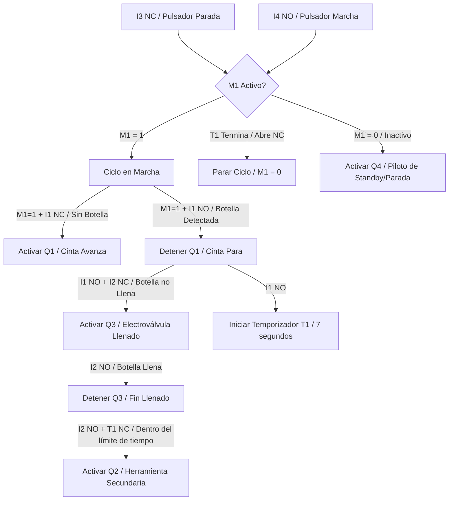

# Máquina Dosificadora de Botellas con Banda Transportadora

---

## 1. Arquitectura del Sistema de Llenado

El nuevo sistema de dosificación industrial automatizado simula una línea de envasado continua. El proceso consta de una **cinta transportadora** que desplaza botellas vacías hacia una **zona de dosificación**. Una vez allí, se detecta la botella, se detiene la cinta, se procede al llenado de líquido y, opcionalmente, a una fase secundaria (cincelado/tapado) antes de continuar el ciclo o detener el proceso mediante un temporizador.

Este sistema está distribuido entre dos softwares interconectados:
1. **CADe SIMU (dosificadora-cadesimu.cad):** Ejecuta la lógica Ladder de control lógico y de temporización del ciclo.
2. **PC SIMU (dosificadora-pcsimu.sim):** Representa el entorno físico en 2D/3D con faja transportadora, botellas, sensores fotoeléctricos, depósitos de líquido y válvulas solenoides.

---

## 2. Lógica de Control (Esquema Ladder)

La lógica de control desarrollada en el PLC del esquema Ladder sigue un ciclo continuo controlado por autorretención (latch) y un temporizador de ciclo general.

### Explicación Detallada de cada Línea (Rung)

* **Rung 1 (Circuito de Marcha y Parada - Lazo de Retención `M1`):**
  * **Estructura:** `I3` (Contacto NC de Parada) en serie con el bloque en paralelo de `I4` (Pulsador de Marcha) y `M1` (Contacto de Autorretención), conectados en serie con `T1` (Contacto NC del Temporizador). Todos gobiernan la bobina interna **`M1`**.
  * **Funcionamiento:** Al presionar el pulsador de marcha (`I4`), se activa la marca de memoria `M1` (Ciclo en Marcha) y queda retenida. La retención se interrumpe inmediatamente si se pulsa el botón de parada (`I3`) o si el temporizador de ciclo `T1` finaliza su conteo y abre su contacto NC.

* **Rung 2 (Control del Motor de la Cinta Transportadora `Q1`):**
  * **Estructura:** Contacto NO de `M1` en serie con el contacto NC de `I1` (Sensor de Botella) hacia la bobina de salida **`Q1`**.
  * **Funcionamiento:** Con el sistema activo (`M1` encendido), el motor de la cinta (`Q1`) se activará y moverá las botellas siempre y cuando **no haya ninguna botella** posicionada frente al sensor de llenado (`I1` inactivo). En cuanto una botella interrumpe al sensor, `I1` se abre, deteniendo el motor instantáneamente.

* **Rung 3 (Control de la Electroválvula de Llenado `Q3`):**
  * **Estructura:** Contacto NO de `M1` en serie con el contacto NO de `I1` (Botella presente) y el contacto NC de `I2` (Sensor de Llenado / Nivel) hacia la bobina de salida **`Q3`**.
  * **Funcionamiento:** Si el ciclo está activo y hay una botella posicionada frente al dosificador (`I1` activo), la válvula de llenado (`Q3`) se abrirá siempre que la botella **no esté llena** (`I2` inactivo). En cuanto el líquido alcanza el sensor de nivel superior, `I2` se abre y corta el llenado.

* **Rung 4 (Temporizador de Seguridad del Ciclo `T1`):**
  * **Estructura:** Contacto NO de `M1` en serie con el contacto NO de `I1` (Botella presente) que activa la entrada del temporizador **`T1`** (configurado a 7.0 segundos).
  * **Funcionamiento:** El conteo del temporizador general se inicia en el momento exacto en que una botella arriba a la zona de llenado. Su función es limitar la duración total del proceso en esa estación antes de reiniciar la secuencia.

* **Rung 5 (Control de la Herramienta / Capping `Q2`):**
  * **Estructura:** Contacto NO de `M1` en serie con el contacto NO de `I2` (Botella Llena) en serie con el contacto NC del temporizador `T1` hacia la bobina de salida **`Q2`**.
  * **Funcionamiento:** Cuando la botella se llena y activa el sensor `I2`, se da inicio a la operación de la herramienta secundaria o taponadora (`Q2`). Esta permanecerá activa hasta que expire el tiempo de seguridad del temporizador `T1`.

* **Rung 6 (Luz Piloto de Standby/Parada `Q4`):**
  * **Estructura:** Contacto NC de `M1` hacia la bobina de salida **`Q4`**.
  * **Funcionamiento:** Si la máquina no está en ciclo (M1 apagado), la salida `Q4` se energiza de forma continua para iluminar el indicador luminoso de Standby.

---

## 3. Disposición de Objetos en PC SIMU

El entorno físico contiene los siguientes elementos gráficos, ordenados de izquierda a derecha en la planta:
* **Depósito de Líquido Principal:** Suministra el producto a través de una tubería.
* **Válvulas Solenoides:** Controlan el flujo de líquido en las tuberías.
* **Herramienta Dosificadora (Dispenser):** Representa la boquilla de llenado suspendida sobre la faja.
* **Faja/Cinta Transportadora:** Mueve las botellas de izquierda a derecha.
* **Sensores Ópticos / Fotoceldas:**
  * **Detector de Posición (Botella):** Detecta la llegada de la botella a la zona de dosificación.
  * **Detector de Nivel de Líquido:** Detecta cuándo la botella está llena.
* **Panel de Control:** Contiene el Pulsador de Marcha (Verde/Azul) y el Pulsador de Parada (Rojo).

---

## 4. PC SIMU

A grandes rasgos, recuerda verificar que:
1. El sensor de posición de botella y el detector de nivel compartan la misma dirección lógica en la tabla de intercambio de CADe SIMU y en el objeto correspondiente de PC SIMU.
2. Los botones de Marcha/Parada y los actuadores (Cinta, Electroválvula de Llenado, Herramienta de Capping) tengan correspondencia directa de direccionamiento físico.
3. Se inicie la simulación en CADe SIMU (Play) **antes** de iniciarla en PC SIMU (computadora de pantalla verde y Play).
